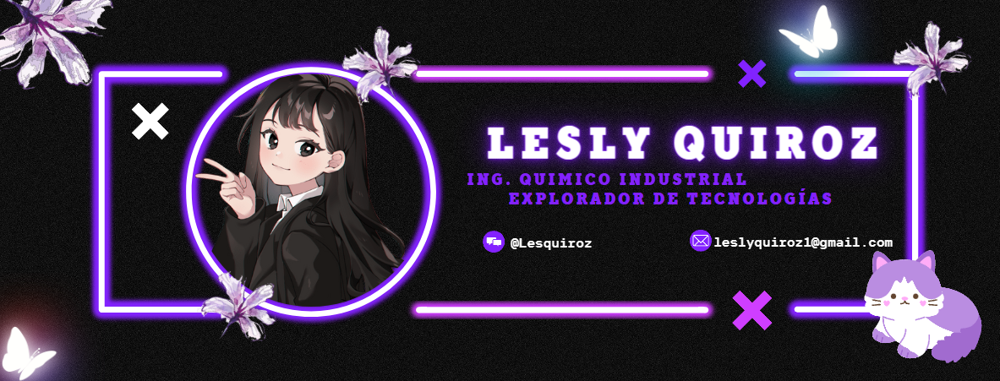

# About me🌸:
🧑🏻‍🔬 My name is Lesly Gabriela Quiroz Bueno
📍I'm from Reynosa, Tamaulipas, Mexico
🧪ING. Chemical Engineer
✨ 25 years old 

-As an Industrial chemical engineer with experience in process optimization, project management, environmental compliance, and safety. Focuses on applying chemical engineering principles to design, develop, and improve industrial systems and processes.

-I'm an enthusiastic tech enthusiast constantly seeking knowledge and skills in digital trends, committed to professional development and immersing myself in emerging technologies to expand my horizons and contribute to technological innovation.👾

-Idioms:
Spanish (native) and English (intermediate).

## Abilities🌟:
-I am learning web programming basics like HTML, CSS, JavaScript and using Bootstrap frameworks to create dynamic and responsive web sites.

-I possess skills in comprehensive project management, including planning, execution, monitoring, and control, ensuring timely completion of deadlines, budgets, and quality standards.

-I'm familiar with cloud computing services from AWS and Google Cloud Platform, implementing and managing scalable and secure applications.
## Personal Projects🌐:
-The individual showcases their skills in forming through personal projects, focusing on the development of a personal website using HTML, CSS, and JavaScript.

-Seeking opportunities for practical experience and strengthening professional profile in technology through internships, projects, or freelance work.

*This technological profile reflects my passion for continuous learning and professional growth in an evolving field. I am excited by emerging technologies' opportunities and ready to face challenges and maximize each learning experience, Also I am committed to continuous improvement and innovation in chemical engineering, constantly seeking new opportunities for growth and learning.*
## Education🧮:
-Online courses and tutorials on platforms like Udemy, Coursera, and Codecademy cover programming, artificial intelligence, blockchain, and related topics. 

-Participation in online communities, study groups, and technology events helps share knowledge and stay updated.

-Licenciatura Industrial Chemical Engineering at the *IPN* University.
## Certifications🏆:
-Certificado en Gestión de Proyectos (PMP).
-Certificado en Lean Six Sigma Green Belt.
-Certificado en Normativas Ambientales ISO 14001.
## Languages and Technologies🖥️:
 
 
 
  

## Find me around the web🌎:
        

## Statistics🔎:

*I am committed to technical excellence and the continuous pursuit of new opportunities to apply technology in creating innovative and disruptive solutions.*
